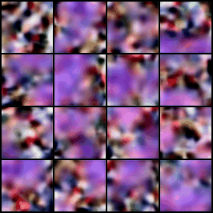
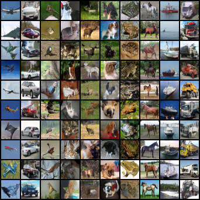
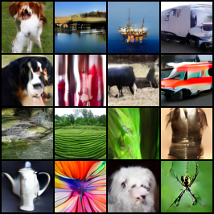

# ArchiRF

<p align="center">
  
</p>

This is a self-interested project to create a Rectified Flow Model for my own experiments. These experiments can be meaningless, but I hope to learn something from them. Specifically, I want to learn how to implement a denoising diffusion probabilistic model(DDPM) and Rectified Flow which simplifies the process of diffusion and produces better results. Besides, I also implement several techniques introduced in some papers to improve the performance of the model.

## Content
This is a part mentioning what I have done in this project. I may keep updating this part to record my process.

### First stage

1. Code for DDPM and Rectified Flow
   You can find the code in the `models` directory. `rf.py` contains the implementation of the Rectified Flow model, and `ddpm.py` contains the implementation of the DDPM model.
2. Code for different model architectures
    You can see different networks architectures in the `modules` directory. Up to now, I have implemented these networks:
    - [Diffusion Transformer](https://arxiv.org/abs/2212.09748) `modules/networks_dit.py`
    - Multi-modal Diffusion Transformer (MMDiT) from [Stable Diffusion 3](https://arxiv.org/abs/2403.12015) `modules/networks_mmdit.py`
    - Unet from [EDM2](https://arxiv.org/abs/2312.02696) paper `modules/networks_karras_unet.py`
    - Classic [ADM](https://arxiv.org/abs/2105.05233) Unet `modules/networks_unet.py`
3. Learning rate scheduler
    I have implemented these learning rate schedulers in `modules/lr_scheduler.py`:
    1. Linear warmup scheduler
    According to the Stable Diffusion 3's paper, the authors use a linear warmup scheduler to warm up the learning rate in the first 1000 iterations.
    2. Inverse square root scheduler
    Authors of EDM2 states that using an inverse square root scheduler can improve the performance of the model given the magnitude preserving techniques of the network.

4. ViT with Registers
    I have implemented registers for ViT which is introduces in the paper [VISION TRANSFORMERS NEED REGISTERS](https://arxiv.org/pdf/2309.16588). Registers are used by default.
    ```python
    from modules.networks_dit import DiT
    net = DiT(num_register_tokens=4) # 4 registers by default
    ```
#### MMDiT
I have implemented the MMDiT network. Following the paper, I made several changes to both the rectified flow framework and diffusion transformer's architecture: 

1. QK normalization
    This can prevent explosion in the attention logits.
2. Logit-Normal Sampling for $t$
    I use the logit-normal distribution to sample $t$ in the rectified flow model. This is said to be better then the uniform distribution.

However, with limited computational resources, I can't train a text-to-image model. I use two class embeddings to simulate the text embeddings. However, I found out training the embeddings is very hard given a large number of classes in ImageNet. According to the StyleGAN-XL paper, it is possible to use pretrained class embeddings from a pretrained image classification model(Efficientnet-lite0 in their paper). They pool the image features at the last layer to act as class embeddings. I may try this method in the future.

My MMDiT model is a bit overfitted from looking at the FID, but at least it can generate some good images.
Samples of generating classes in CIFAR10 with MMDiT:
<p align="center">
  
</p>
Animation:
<p align="center">
  

### Second stage

At this stage, I will to level up this repo by implementing and training a [latent diffusion](https://arxiv.org/abs/2112.10752) model from scratch by myself. Most of the code on this stage are in the `autoencoder` directory. Due to limited computational resources, I will the Autoencoder model on ImageNet dataset with 64x64 resolution. After encoding the images with shape `[B, 3, 64, 64]`, I can get a latent features with shape `[B, 16, 8, 8]`.

1. AutoencoderKL
    Following the paper, I implemented the classic VAE model with KL divergence loss.

2. Custom Autoencoder for latent diffusion
    Based on the problem of the classic VAE model, I implemented a custom autoencoder which imo is more suitable for latent diffusion model. The custom autoencoder will be explained in the next part.

3. Larger Latent Channels
    According to SD3 paper, the larger output latent channels can produce better image quality.

#### What's wrong with VAE?
There are already a few discussions about the issues of VAE in Stable Diffusion. FYR, you can check the links below:
- https://news.ycombinator.com/item?id=39215242
- https://news.ycombinator.com/item?id=39215949
- https://www.reddit.com/r/StableDiffusion/comments/1agd5pz/a_recent_post_went_viral_claiming_that_the_vae_is/?sort=new

I can summarize the problems of VAE as follows:
1. The output latent of the encoder is not bounded to [-1, 1] with variance 0. This can introduce more difficulties in the diffusion process because we denoise the latent from a noise from a normal distribution. The scaling factor in VAE of SD cannot guarantee the latent to be in the range [-1, 1].
2. KL regularization is not enough to prevent the encoder from limiting the latent space.
3. VAE is not the only option for latent diffusion. VQVAE is also been tested in the original paper. But why don't we try a vanilla autoencoder? Given the fact that people found out the variance term in VAE is not necessary to get a good quality of output image. (See the third link above)

#### Custom Autoencoder
Grouping the ideas from others, I implemented a custom autoencoder for latent diffusion. The custom autoencoder has the same architecture with my AutoencoderKL model, but having a few modifications:
1. the encoded latent is clipped to [-1, 1]
2. variance term is not needed because we don't need to sample from a normal distribution
3. the autoencoder is trained with the same loss functions introduced with original one in stable diffusion. However, instead of using KL divergence, I use a simple variance loss term to guide the latent space to have a standard deviation of 1.
4. A gain parameter is added to the autoencoder to scale the latent space. It is reasonable that the encoded latent is not always having a normal distribution. Besides, simply clipping the latents may produce feature loss. The gain parameter can help to scale for better results.

##### Findings on the custom autoencoder
1. Without the scaling term, the autoencoder is more diffusion to train. From my runs, the loss of the autoencoder is dropping slower without the scaling term.
2. The variance loss term needs scaling. I found out that the variance loss term is too large to train the autoencoder. I scale the variance loss term by 0.01 to get a better result.
3. As the training goes on, the autoencoder will have a better variance of the latent space while the scaling term keeps decreasing.

I may try to train the autoencoder with more modern GAN techniques like projected GAN or Squeeze-and-Excitation in the generator. But I think it is not necessary for now.

### Latent Rectified Flow (Still Training?)
After all, I can use the trained autoencoder to train a latent rectified model. I found that training a latent diffusion/rf model is way harder than training one on pixel space.

Samples of generating some classes in ImageNet with MMDiT and Latent RF:
<p align="center">
  
</p>