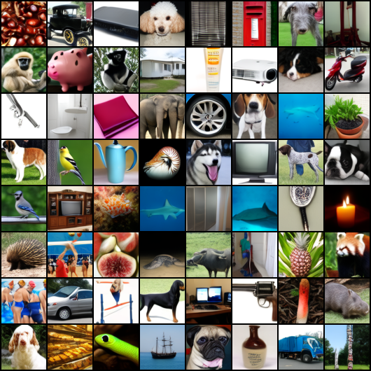

# ArchiRF

<p align="center">
  
</p>

This is a self-interested project to create a Rectified Flow Model for my own experiments. These experiments can be meaningless, but I hope to learn something from them. Specifically, I want to learn how to implement a denoising diffusion probabilistic model(DDPM) and Rectified Flow which simplifies the process of diffusion and produces better results. Besides, I also implement several techniques introduced in some papers to improve the performance of the model. The whole project is trained using a single RTX 4090 GPU.

## Update
[2024-08-05] I have retrained a new autoencoder and a MMDiT with pretrained features from efficientnet-lite0. Less multimodal blocks are used in the new MMDiT model. You can refer to `config/imagenet-lrf-in1kmmdit.yaml`.

## Content
This is a part mentioning what I have done in this project. I may keep updating this part to record my process.

### First stage

1. Code for DDPM and Rectified Flow \
   You can find the code in the `models` directory. `rf.py` contains the implementation of the Rectified Flow model, and `ddpm.py` contains the implementation of the DDPM model.
2. Code for different model architectures \
    You can see different networks architectures in the `modules` directory. Up to now, I have implemented these networks:
    - [Diffusion Transformer](https://arxiv.org/abs/2212.09748) `modules/networks_dit.py`
    - Multi-modal Diffusion Transformer (MMDiT) from [Stable Diffusion 3](https://arxiv.org/abs/2403.12015) `modules/networks_mmdit.py`
    - Unet from [EDM2](https://arxiv.org/abs/2312.02696) paper `modules/networks_karras_unet.py`
    - Classic [ADM](https://arxiv.org/abs/2105.05233) Unet `modules/networks_unet.py`
3. Learning rate scheduler \
    I have implemented these learning rate schedulers in `modules/lr_scheduler.py`:
    1. Linear warmup scheduler \
    According to the Stable Diffusion 3's paper, the authors use a linear warmup scheduler to warm up the learning rate in the first 1000 iterations.
    2. Inverse square root scheduler \
    Authors of EDM2 states that using an inverse square root scheduler can improve the performance of the model given the magnitude preserving techniques of the network.

4. ViT with Registers \
  I have implemented registers for ViT which is introduces in the paper [VISION TRANSFORMERS NEED REGISTERS](https://arxiv.org/pdf/2309.16588). Registers are used by default.
  ```python
  from modules.networks_dit import DiT
  net = DiT(num_register_tokens=4) # 4 registers by default
  ```
#### MMDiT
I have implemented the MMDiT network. Following the paper, I made several changes to both the rectified flow framework and diffusion transformer's architecture: 

1. QK normalization \
  This can prevent explosion in the attention logits.
2. Logit-Normal Sampling for $t$ \
I use the logit-normal distribution to sample $t$ in the rectified flow model. This is said to be better then the uniform distribution.
3. Less multimodal blocks \
From aura flow, less multimodal blocks can improve the performance of the model with less computational cost.

However, with limited computational resources, I can't train a text-to-image model. I use two class embeddings to simulate the text embeddings. However, I found out training the embeddings is very hard given a large number of classes in ImageNet. According to the StyleGAN-XL paper, it is possible to use pretrained class embeddings from a pretrained image classification model(Efficientnet-lite0 in their paper). They pool the image features at the last layer to act as class embeddings. I may try this method in the future.

My MMDiT model is a bit overfitted from looking at the FID, but at least it can generate some good images.
Samples of generating classes in CIFAR10 with MMDiT:
<p align="center">
  
</p>
Animation:
<p align="center">
  

### Second stage

At this stage, I will to level up this repo by implementing and training a [latent diffusion](https://arxiv.org/abs/2112.10752) model from scratch by myself. Most of the code on this stage are in the `autoencoder` directory. Due to limited computational resources, I will the Autoencoder model on ImageNet dataset with 64x64 resolution. After encoding the images with shape `[B, 3, 64, 64]`, I can get a latent features with shape `[B, 16, 8, 8]`.

1. AutoencoderKL \
Following the paper, I implemented the classic VAE model with KL divergence loss.

2. Custom Autoencoder for latent diffusion \
Based on the problem of the classic VAE model, I implemented a custom autoencoder which imo is more suitable for latent diffusion model. The custom autoencoder will be explained in the next part.

3. Larger Latent Channels \
According to SD3 paper, the larger output latent channels can produce better image quality.

### Latent Rectified Flow (Still Training?)
After all, I can use the trained autoencoder to train a latent rectified model. I found that training a latent diffusion/rf model is way harder than training one on pixel space.

Animation of generating some classes in ImageNet with MMDiT and Latent RF:
<p align="center">
  
</p>

## Train a model
For autoencoder, please check `autoencoder/train.py` for training a autoencoder model.
For DDPM/RF, please check `train.py` for training a DDPM/RF model.
You can refer to the config files in each `config` directory to see the training configurations.

To train an autoencoder:
```bash
cd autoencoder
python train.py --config-name {CONFIG_NAME}
```
with a config in `autoencoder/config` directory.

To train a DDPM/RF model:
```bash
python train.py --config-name {CONFIG_NAME}
```
with a config in `config` directory.